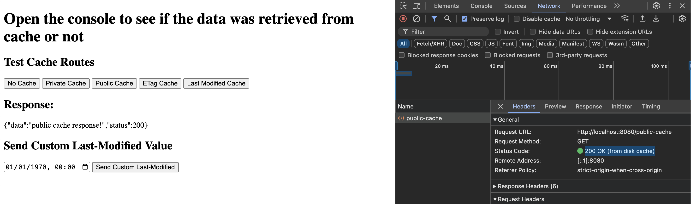
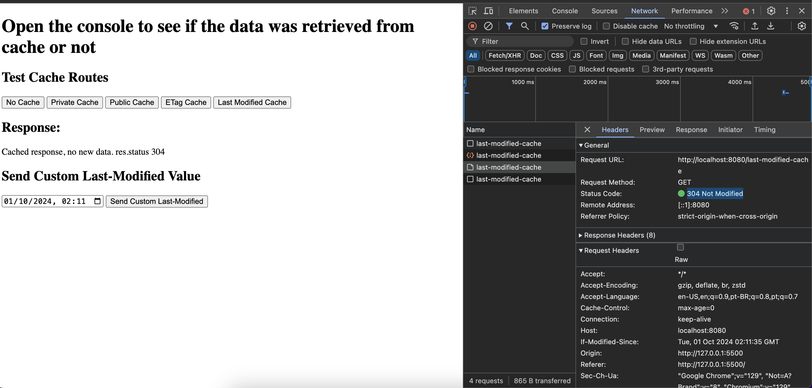

# HTTP Caching Example

- This repository is a practical example of HTTP caching.
- It demonstrates how to implement and test different caching strategies using Node.js and a simple HTML frontend.
- You can read more about HTTP caching theory at [HTTP Caching 101](https://dev.to/godinhojoao/-http-caching-101-4ib0).

## Prerequisites

Make sure you have the following installed on your machine:

- [Node.js](https://nodejs.org/)
- [NVM (Node Version Manager)](https://github.com/nvm-sh/nvm#installing-and-updating)

## How to Run the Server

1. **Clone the repository:**

   ```bash
   git clone <repository-url>
   cd <repository-folder>
   ```

2. **Install the desired Node.js version using NVM:**

   ```bash
   nvm install 22.9.0
   ```

3. **Use the installed Node.js version:**

   ```bash
   nvm use
   ```

4. **Start the server:**

   ```bash
   node src/index.js
   ```

   The server will start running on `http://localhost:8080`.

## How to Run the Frontend

To view the frontend HTML file (`index.html`), use Live Server or another tool.

## Usage

Once both the server and the frontend are running, you can test the caching strategies by clicking the buttons in the web interface. Open the browser's console to view logs about whether data was retrieved from the cache or fetched from the server.

- Example public cache: 
- Example last modified cache: 

## Where to find the theory:

- https://dev.to/godinhojoao/-http-caching-101-4ib0
